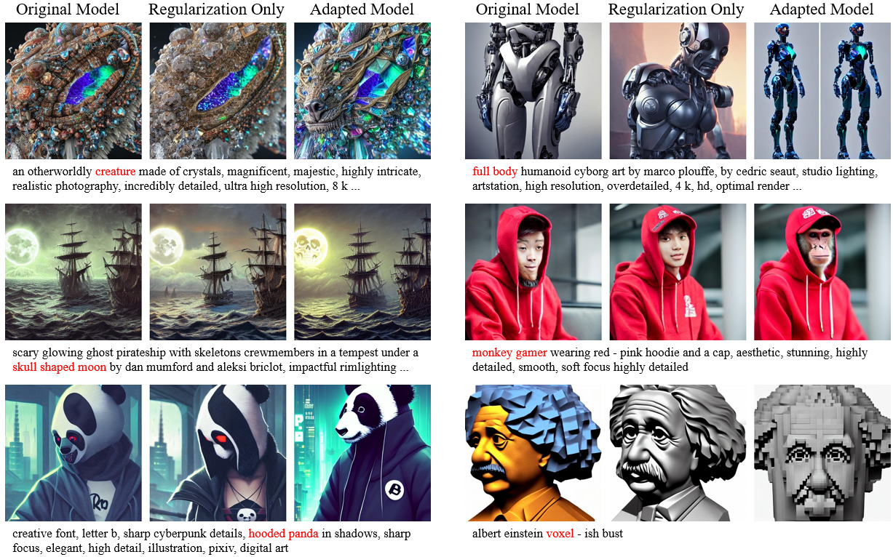
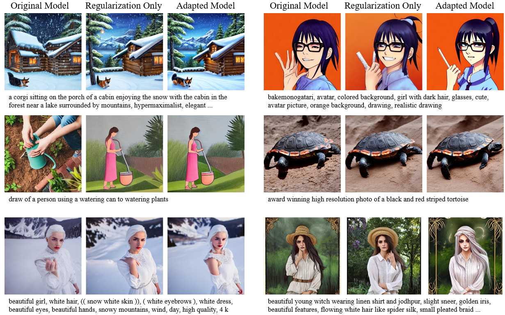

# Better Aligning Text-to-Image Models with Human Preference


### [project page](TBD) | [arxiv](TBD)

This is the official repository for the paper: Better Aligning Text-to-Image Models with Human Preference. The paper demonstrates that Stable Diffusion can be improved via learning from human preferences. By learning from human preferences, the model is better aligned with user intentions, and also produce images with less artifacts, such as weird limbs and faces.

## Human preference dataset


The dataset is collected from the Stable Foundation Discord server. We record human choices on images generated with the same prompt but with different random seeds.
The dataset can be downloaded from TBD.

<!-- data format specification -->

## Human Preference Classifier
The pretrained human preference classifier can be downloaded from TBD.
Before running the human preference classifier, please make sure you have set up the CLIP environment as specified in [here](https://github.com/openai/CLIP).

```python
import torch
import clip
from PIL import Image

device = "cuda" if torch.cuda.is_available() else "cpu"
model, preprocess = clip.load("ViT-L/14", device=device)
params = torch.load("path/to/checkpoint.pth")['state_dict']
model.load_state_dict(params)

image1 = preprocess(Image.open("image1.png")).unsqueeze(0).to(device)
image2 = preprocess(Image.open("image2.png")).unsqueeze(0).to(device)
images = torch.cat([image1, image2], dim=0)
text = clip.tokenize(["your prompt here"]).to(device)

with torch.no_grad():
    image_features = model.encode_image(images)
    text_features = model.encode_text(text)

    image_features = image_features / image_features.norm(dim=-1, keepdim=True)
    text_features = text_features / text_features.norm(dim=-1, keepdim=True)

    hps = image_features @ text_features.T
```
Remember to replace `path/to/checkpoint.pth` with the path of the downloaded checkpoint.
The training script is based on [OpenCLIP](https://github.com/mlfoundations/open_clip). We thank the community for their valuable work.
The script will be released soon.

## Adapted model
The LORA checkpoint of the adapted model can be found [here](TBD). We also provide the regularization only model trained without the guidance of human preferences at [here](TBD).
Please refer to the paper for the training details. The training script will be released soon.

## Visualizations

